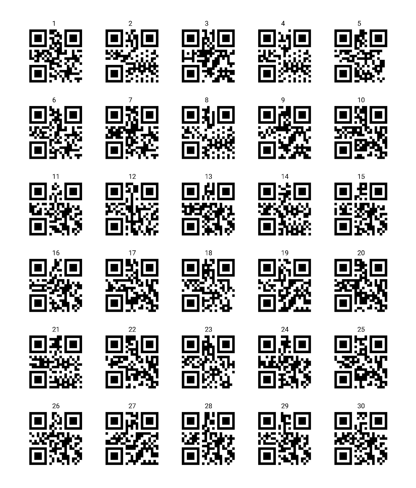

#  Serial QR Code Generator

Generate a multi-page PDF of serial QR Codes using a series of identifiers of your choice.
Below is a single page of QR codes from 1 to 30:
<br>
`$ python3 gen_qr_codes.py 1 30`...
<br>


## Usage
### How to install dependencies:
```
python3 -m venv venv
source venv/bin/activate
pip install -r requirements.txt
```

### How to generate QR codes:
```
usage: gen_qr_codes.py [-h] s n

Generate n QR Codes starting with the number s.

positional arguments:
  s           The identifying number for the first qr code, e.g. 100
              results in the series 100, 101, 102...
  n           How many total QR codes to generate, e.g. 10 will create
              ten QR codes.

options:
  -h, --help  show this help message and exit
```

#### Example:
`python3 gen_qr_codes.py 1 50`
will generate 50 QR Codes starting with the first QR code corresponding to 1, 
the second corresponding to 2, the third corresponding to 3...

The output will be a multi-page PDF named `qr_codes_1_through_50.pdf` in the current directory.
The script also creates a folder `individual_pages` which contains individual pages of QR codes,
such as `qr_codes_1_through_30.pdf` and `qr_codes_31_through_50.pdf`.

The result should look like: <br>


